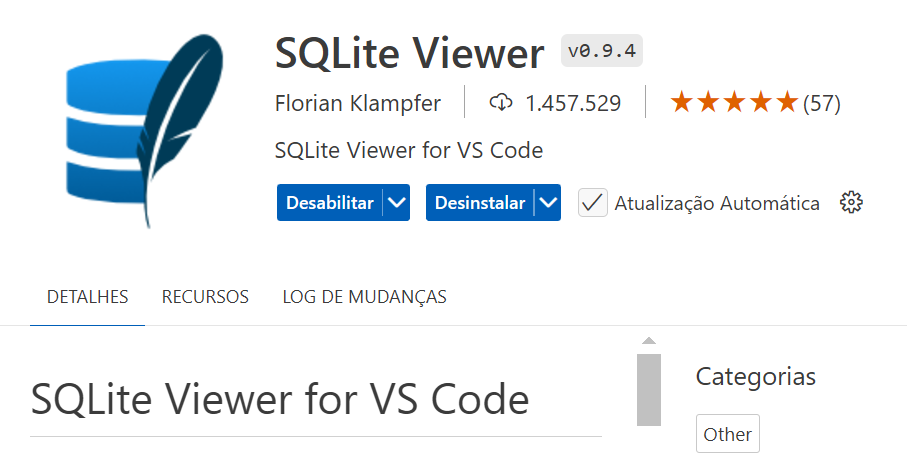

# java-sqlite-05-dao

1) Criar um repositório público para o projeto no `GitHub`. Ao criar o projeto, marcar as opções `Public` e `Add a README file`. No item `Add .gitignore`, selecionar a opção `Maven`. Em seguida, clicar no botão `Code` e iniciar um `Codespace` clicando em `Create a codespace on main`.

2) No `Codespace`, instalar a extensão (_plugin_) VS Code `SQLite Viewer for VS Code`:


3) No `Codespace`, criar a estrura de diretório:
```
  src/main/java
```

4) Criar o arquivo `Usario.java` dentro de `src/main/java` com o conteúdo abaixo:
```java
public class Usuario {
    private int id;
    private String nome;
    private String nascimento;

    public Usuario(){}

    public int getId() {return this.id;}
    public void setId(int id) {this.id = id;}

    public String getNome() {return this.nome;}
    public void setNome(String nome) {this.nome = nome;}

    public String getNascimento() {return this.nascimento;}
    public void setNascimento(String nascimento) {this.nascimento = nascimento;}
}
```

5) Criar o arquivo `ConnectionFactory.java` dentro de `src/main/java` com o conteúdo abaixo:
```java
import java.sql.Connection;
import java.sql.DriverManager;

public class ConnectionFactory {
    private Connection connection = null;

    public ConnectionFactory() {
    }

    public Connection createConnection() {
        try {
            // Conectar ao banco de dados SQLite:
            this.connection = DriverManager.getConnection("jdbc:sqlite:teste.db");
            System.out.println("Conexão com SQLite estabelecida!");
        } catch (Exception e) {
            System.err.println("Não foi possível estabelecer conexão com SQLite!");
            e.printStackTrace();
        }
        return this.connection;    
    }
}
```

6) Criar o arquivo `UsuarioDAO.java` dentro de `src/main/java` com o conteúdo abaixo:
```java
import java.sql.SQLException;
import java.sql.Connection;
import java.sql.Statement;
import java.sql.PreparedStatement;
import java.sql.ResultSet;

public class UsuarioDAO {
    public void createTable() {
        Connection connection = null;
        Statement statement = null;

        try {
            // Utilizar a fábrica de conexões para criar uma Connection SQL:
            ConnectionFactory connectionFactory = new ConnectionFactory();
            connection = connectionFactory.createConnection();

            // Criar um statement baseado em uma string SQL:
            String createTableSQL = """
                      CREATE TABLE IF NOT EXISTS usuario (
                        id INTEGER PRIMARY KEY AUTOINCREMENT,
                        nome VARCHAR(256) NOT NULL,
                        nascimento TEXT
                      );
                    """;
            statement = connection.createStatement();
            statement.execute(createTableSQL);
            System.out.println("Tabela 'usuario' criada ou já existe!");
        } catch (SQLException e) {
            System.err.println("Erro na comunicação com o banco de dados!");
            e.printStackTrace();
        } finally {
            try {
                if (statement != null)
                    statement.close();
                if (connection != null)
                    connection.close();
            } catch (SQLException e) {
                e.printStackTrace();
            }
        }
    }

    public Usuario create(Usuario usuario) {
        Connection connection = null;
        PreparedStatement preparedStatement = null;

        try {
            // Utilizar a fábrica de conexões para criar uma Connection SQL:
            ConnectionFactory connectionFactory = new ConnectionFactory();
            connection = connectionFactory.createConnection();

            // Criar um preparedStatement baseado em uma string SQL:
            String insertSQL = "INSERT INTO usuario (nome, nascimento) values (?, ?)";
            preparedStatement = connection.prepareStatement(insertSQL);

            // Preencher os valores no PreparedStatement:
            preparedStatement.setString(1, usuario.getNome());
            preparedStatement.setString(2, usuario.getNascimento());

            // Executar o comando SQL:
            preparedStatement.execute();
            usuario.setId(this.readLastInsertedId(connection));

            System.out.println(
                    "USUÁRIO GRAVADO NO BANCO DE DADOS: " +
                            "\nID: " + usuario.getId() +
                            "\nNOME: " + usuario.getNome() +
                            "\nDATA DE NASCIMENTO: " + usuario.getNascimento());
        } catch (SQLException e) {
            System.err.println("Erro na comunicação com o banco de dados!");
            e.printStackTrace();
        } finally {
            try {
                if (preparedStatement != null)
                    preparedStatement.close();
                if (connection != null)
                    connection.close();
            } catch (SQLException e) {
                e.printStackTrace();
            }
        }
        return usuario;
    }

    public int readLastInsertedId(Connection connection) {
        int lastInsertedId = -1;
        PreparedStatement preparedStatement = null;
        ResultSet resultSet = null;

        try {
            // Criar um preparedStatement baseado em uma string SQL:
            String selectSQL = "SELECT MAX(id) AS max_id FROM usuario";
            preparedStatement = connection.prepareStatement(selectSQL);

            // Executar o comando SQL:
            resultSet = preparedStatement.executeQuery();
            if (resultSet.next()) {
                lastInsertedId = resultSet.getInt("max_id");
            } else {
                System.out.println("Não foi possível recuperar o último identificador gerado pelo banco de dados!");
            }
        } catch (SQLException e) {
            System.err.println("Erro na comunicação com o banco de dados!");
            e.printStackTrace();
        } finally {
            try {
                if (resultSet != null)
                    resultSet.close();
                if (preparedStatement != null)
                    preparedStatement.close();
            } catch (SQLException e) {
                e.printStackTrace();
            }
        }
        return lastInsertedId;
    }

    public Usuario read(int id) {
        Usuario usuario = null;
        Connection connection = null;
        PreparedStatement preparedStatement = null;
        ResultSet resultSet = null;

        try {
            // Utilizar a fábrica de conexões para criar uma Connection SQL:
            ConnectionFactory connectionFactory = new ConnectionFactory();
            connection = connectionFactory.createConnection();

            // Criar um preparedStatement baseado em uma string SQL:
            String selectSQL = "SELECT * FROM usuario WHERE id = ?";
            preparedStatement = connection.prepareStatement(selectSQL);

            // Preencher o valor do identificador no PreparedStatement:
            preparedStatement.setInt(1, id);

            // Executar o comando SQL:
            resultSet = preparedStatement.executeQuery();
            if (resultSet.next()) {
                usuario = new Usuario();
                usuario.setId(resultSet.getInt("id"));
                usuario.setNome(resultSet.getString("nome"));
                usuario.setNascimento(resultSet.getString("nascimento"));
                System.out.println(
                        "USUÁRIO LIDO DO BANCO DE DADOS: " +
                                "\nID: " + usuario.getId() +
                                "\nNOME: " + usuario.getNome() +
                                "\nDATA DE NASCIMENTO: " + usuario.getNascimento());
            } else {
                System.out.println("Usuário não encontrado!");
            }
        } catch (SQLException e) {
            System.err.println("Erro na comunicação com o banco de dados!");
            e.printStackTrace();
        } finally {
            try {
                if (resultSet != null)
                    resultSet.close();
                if (preparedStatement != null)
                    preparedStatement.close();
                if (connection != null)
                    connection.close();
            } catch (SQLException e) {
                e.printStackTrace();
            }
        }
        return usuario;
    }

    public void update(Usuario usuario) {
        Connection connection = null;
        PreparedStatement preparedStatement = null;

        try {
            // Utilizar a fábrica de conexões para criar uma Connection SQL:
            ConnectionFactory connectionFactory = new ConnectionFactory();
            connection = connectionFactory.createConnection();

            // Criar um preparedStatement baseado em uma string SQL:
            String updateSQL = "UPDATE usuario SET nome = ?, nascimento = ? WHERE id = ?";
            preparedStatement = connection.prepareStatement(updateSQL);

            // Preencher os valores no PreparedStatement:
            preparedStatement.setString(1, usuario.getNome());
            preparedStatement.setString(2, usuario.getNascimento());
            preparedStatement.setInt(3, usuario.getId());

            // Executar o comando SQL:
            preparedStatement.executeUpdate();

            System.out.println("O usuário " + usuario.getNome() + " foi atualizado no banco de dados!");
        } catch (SQLException e) {
            System.err.println("Erro na comunicação com o banco de dados!");
            e.printStackTrace();
        } finally {
            try {
                if (preparedStatement != null)
                    preparedStatement.close();
                if (connection != null)
                    connection.close();
            } catch (SQLException e) {
                e.printStackTrace();
            }
        }
    }

    public void delete(Usuario usuario) {
        Connection connection = null;
        PreparedStatement preparedStatement = null;

        try {
            // Utilizar a fábrica de conexões para criar uma Connection SQL:
            ConnectionFactory connectionFactory = new ConnectionFactory();
            connection = connectionFactory.createConnection();

            // Criar um preparedStatement baseado em uma string SQL:
            String deleteSQL = "DELETE FROM usuario WHERE id = ?";
            preparedStatement = connection.prepareStatement(deleteSQL);

            // Preencher os valores no PreparedStatement:
            preparedStatement.setInt(1, usuario.getId());

            // Executar o comando SQL:
            preparedStatement.execute();

            System.out.println("O usuario " + usuario.getNome() + " foi removido do BD.");
        } catch (SQLException e) {
            System.err.println("Erro na comunicação com o banco de dados!");
            e.printStackTrace();
        } finally {
            try {
                if (preparedStatement != null)
                    preparedStatement.close();
                if (connection != null)
                    connection.close();
            } catch (SQLException e) {
                e.printStackTrace();
            }
        }
    }
}
```

7) Criar o arquivo `Main.java` dentro de `src/main/java` com o conteúdo abaixo:
```java
public class Main {
    public static void main(String[] args) {
        // Criar o DAO para conexão com o banco de dados:
        UsuarioDAO usuarioDAO = new UsuarioDAO();

        //Criar a tabela usuario no banco de dados:
        usuarioDAO.createTable();
        
        // Criar um usuario:
        Usuario usuario = new Usuario();
        usuario.setNome("Ana");
        usuario.setNascimento("2000-06-07");

        // Salvar o usuario no banco de dados:
        usuario = usuarioDAO.create(usuario);

        // Ler as informações cadastradas no banco de dados:
        usuarioDAO.read(usuario.getId());

        // Atualizar as informações do usuario:
        usuario.setNome("Ana Silva"); 
        usuarioDAO.update(usuario); 

        // Ler as informações atualizadas no banco de dados:
        usuarioDAO.read(usuario.getId());

        // Remover o usário:
        usuarioDAO.delete(usuario);

        // Verificar se as informações foram mesmo removidas:
        usuarioDAO.read(usuario.getId());
    }
}
```

8) No `Codespace`, instalar a extensão (_plugin_) VS Code `Extension Pack for Java`:


9) Criar o arquivo `pom.xml` com o conteúdo abaixo para projetos que usam `Maven` no diretório raiz do projeto:
```xml
<project xmlns="http://maven.apache.org/POM/4.0.0" xmlns:xsi="http://www.w3.org/2001/XMLSchema-instance" xsi:schemaLocation="http://maven.apache.org/POM/4.0.0 http://maven.apache.org/xsd/maven-4.0.0.xsd">
    <modelVersion>4.0.0</modelVersion>

    <groupId>com.exemplo</groupId>
    <artifactId>meu-projeto</artifactId>
    <version>1.0-SNAPSHOT</version>

    <properties>
        <maven.compiler.source>15</maven.compiler.source>
        <maven.compiler.target>15</maven.compiler.target>
    </properties>

    <dependencies>
        <dependency>
            <groupId>org.xerial</groupId>
            <artifactId>sqlite-jdbc</artifactId>
            <version>3.34.0</version>
        </dependency>
    </dependencies>

    <build>
        <plugins>
            <plugin>
                <groupId>org.apache.maven.plugins</groupId>
                <artifactId>maven-compiler-plugin</artifactId>
                <version>3.8.1</version>
                <configuration>
                    <source>15</source>
                    <target>15</target>
                </configuration>
            </plugin>
            <plugin>
                <groupId>org.codehaus.mojo</groupId>
                <artifactId>exec-maven-plugin</artifactId>
                <version>1.6.0</version>
                <executions>
                    <execution>
                        <goals>
                            <goal>java</goal>
                        </goals>
                    </execution>
                </executions>
                <configuration>
                    <mainClass>Main</mainClass>
                </configuration>
            </plugin>
        </plugins>
    </build>
</project>
```
 
 10) Instalar todas as dependências do projeto `Maven` listadas no arquivo `pom.xml`:
```
  mvn clean install
```

 11) Compilar o projeto:
 ```
  mvn clean compile
 ```

 12) Executar o projeto:
 ```
  mvn exec:java -Dexec.mainClass="Main"
 ```
 
 13) Saída:
 
 

 14) Clicar no arquivo `teste.db`. No painel lateral direito, clicar na tabela `usuario`. Observar os registros inseridos na tabela:


15) Executar:
```
  git add .
```

```
  git commit -m "mensagem"
```

```
  git push
```